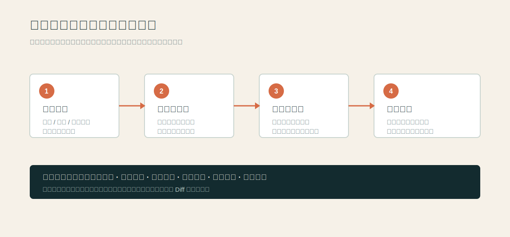
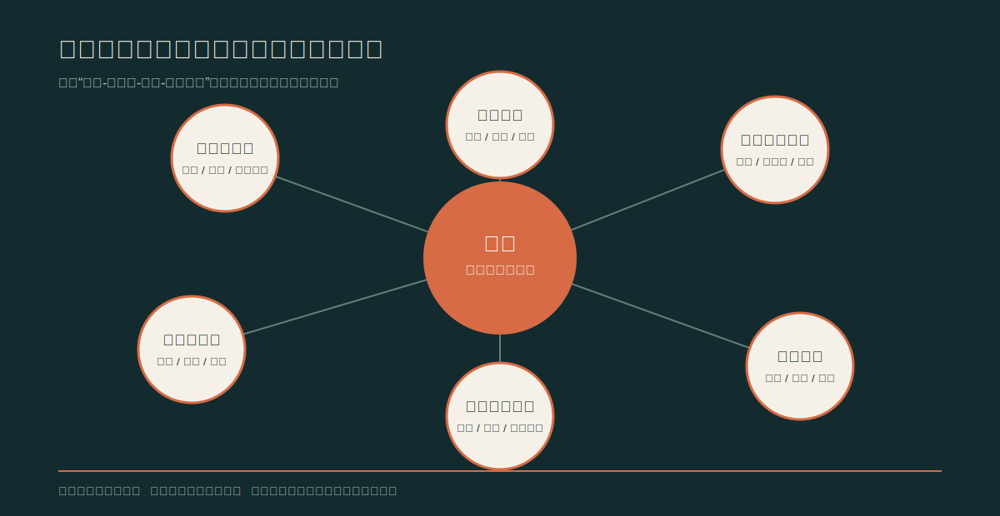

# 靶点罗盘 OncoTarget Compass

靶点罗盘是一套面向肿瘤研发团队的证据链驱动靶点情报与立项学习系统。它把论文、组学数据库、临床试验、指南、药品标签和公开管线组织成可追溯、可更新的靶点知识体系，帮助研发新人回答三个问题：为什么值得做、难在哪里、如何形成差异化。

> 本仓库是竞赛阶段的方案验证材料，不代表已完成软件部署。示例卡片依据公开资料编写；所有模型判断、目标指标和落地路径均应经过后续试点验证。

## 使用流程

1. 输入靶点、适应症、药物形式或自然语言问题。
2. 系统统一靶点、药物、癌种、试验和生物标志物名称。
3. 从受控公开数据源检索并抽取支持证据、反向证据和证据缺口。
4. 生成一页速读靶点卡片，并允许按生物学、临床或竞争问题追问。
5. 输出风险清单、差异化假设和需要专家确认的验证问题。

## 产品结构

- `docs/`：项目策划、用户流程和落地路线。
- `examples/`：KRAS G12C、CLDN18.2 卡片与追问式学习示例。
- `data-model/`：卡片字段、证据等级和知识图谱关系设计。
- `references/`：参考资料、数据源和阅读说明。
- `assets/`：仓库展示用流程图和知识图谱示意图。

## 关键设计原则

1. 事实、模型推断和研发建议分层展示，关键结论必须可回到原始来源。
2. 负向证据不是附录，而是靶点卡片的固定栏目；系统优先提示失败、耐药、毒性和标志物失效线索。
3. 以“靶点-适应症-生物标志物-药物形式”为分析单元，不用靶点热度替代立项判断。
4. 通过版本和 Diff 记录临床状态、标签和竞争项目变化，避免静态报告过时。
5. 对证据不足的早期靶点明确显示不确定性和待验证问题，不强行生成完整结论。

## 预期落地方式

首期接入 PubMed/PMC、Open Targets、ClinicalTrials.gov、FDA/DailyMed，以及 NMPA/CDE 和企业公开管线等合法公开资料。采用检索增强生成、实体标准化、知识图谱、规则校验和人工复核，不从零训练基础模型。上线验收采用标准靶点集与真实任务对照，观察资料整理耗时、可核验引用比例、专家复核通过率、关键证据缺口识别率和用户复用率；具体阈值在试点基线建立后确定。

## 仓库说明

本仓库不包含付费墙论文全文、患者隐私数据、企业内部资料或未经授权的数据集。文件中的“示例”“方案设计”“拟接入”均为明确标注的概念验证内容，后续开发需要进行数据授权、工程安全、医学审阅和合规评估。
